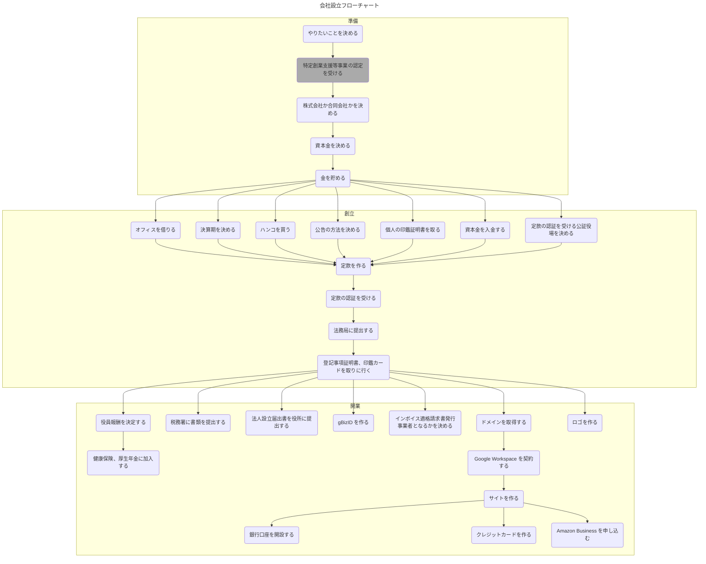

:::message
この記事を読んだ方から有益な情報をたくさんいただいたので追記している。

- 特定創業支援等事業の認定
- 法人設立ワンストップサービス
- gBizID

自分でやっていないものについては各項目で明記している。
:::

# なぜ作ったのか？

自分の興味があった教育分野において、実際にやってみて自ら経験を積み、社会に役立つようなことがやりたいと思ったため。

あと、長くサラリーマンをやって、矛盾している組織が許せない性分だとわかったので、じゃあ自分で組織を作ってみようという単純な発想による。できるだけ矛盾していない組織を作ろうと目指しているが、やらずに文句だけ言うのはフェアでない、という意味合いもある。

# フローチャート

やることが多く、時系列がわかりづらかったのでフローチャートを書いてみた。

週一で動いた場合、 3 ヶ月ほどかかる。また、灰色の枠は実施していない。

# 経費について

:::message
やることすべてについて当てはまる
:::

[登記前にかかった費用はすべて創立費、登記後から事業開始までにかかった費用は開業費として、経費計上が可能だ](https://www.freee.co.jp/kb/kb-launch/cost-expenses/)。そのため、経費清算用のレシートや領収書は取っておくと良い。余裕があればその日のうちに会計ソフトなどに記録すると忘れることもなく良いだろう。

支払先がインボイス適格請求書発行事業者に該当するかどうかについて、基本は国税庁のサイトで調べれば良い。

https://www.invoice-kohyo.nta.go.jp/

ただし、現在は制度開始直後ということもあって登録番号がわからないこともある。その場合は国税庁の別サービスで法人番号を調べられるので、それをインボイス制度適格請求書発行事業者公表サイトに入力すると良い。

https://www.houjin-bangou.nta.go.jp/

使用している SaaS が海外事業者によって提供されている場合も同様の方法で調べられるはずだが、国外の事業者については次にリストとしてまとまっている。ここで検索するのが速いだろう。月初にアップデートされるそうなので、定期的に確認すると良い。

https://www.nta.go.jp/publication/pamph/shohi/cross/touroku.pdf

なお、事業者が国内か国外かを問わず、適格請求書発行事業者でない場合の処理は同様で、単純に仕入税額控除ができないだけだ。

この辺の知見は[国税庁が提供しているインボイス制度の相談窓口](https://www.nta.go.jp/taxes/shiraberu/zeimokubetsu/shohi/keigenzeiritsu/invoice.htm)で税理士さんに伺ったものなので、多分間違いないはず。

# やったこと

何からはじめていいかまったくわからなかったので、 [freee 会社設立](https://support.freee.co.jp/hc/ja/articles/206245013-freee%E4%BC%9A%E7%A4%BE%E8%A8%AD%E7%AB%8B-%E3%82%B5%E3%83%BC%E3%83%93%E3%82%B9%E7%B4%B9%E4%BB%8B)を使用した。以降、やったことに関しては freee 会社設立のフローに則っているが、それぞれで悩んだポイントや気をつけたほうがいいことを記載する。起業される方は参考にしてほしい。

なお、ひとりで作ったので、複数人で作る場合はまた勝手が違うはずだ。

:::message
次は[はてなブックマークコメント](https://b.hatena.ne.jp/prograti/20231029#bookmark-4744222699809266063)からの情報。
:::

法人設立ワンストップサービスというものもあるらしい。国が提供しているもので、[フローチャートも公開されている](https://app.e-oss.myna.go.jp/Application/ecOssTop/exec?corpFlow)ので、こちらをベースに作業しても良いだろう。

https://app.e-oss.myna.go.jp/Application/ecOssTop/

## やりたいことを決める

起業によって何をしたいのかを明らかにする。起業したあとは経営が長く続くので、一番大切なことだ。

具体的な方法は千差万別あるので詳しく触れないが、自身の根源と向き合うくらいまでやったほうが良いと考えている。起業や経営は金銭コストをそれなりに、時間コストを大量に消費するため、大義名分や見栄などでは続かない気がする。

## 特定創業支援等事業の認定

https://twitter.com/dall_develop/status/1719196579062763644?s=61

中小企業庁が各自治体と連携して、創業支援をしているようだ。

https://www.chusho.meti.go.jp/keiei/chiiki/nintei.html

認定してもらうことの一番のメリットは登録免許税が半分で済むことだ。株式会社を作る場合、 ¥75,000 の節約となる。

認定方法やその他細かいメリットについては自治体が提供するサイトを参照すると良い。

## 株式会社か合同会社かを決める

気分で決めれば良い。メリデメはない。

合同会社のほうが多少、金銭コストを抑えられることと、手続きがオンラインで済むことくらいだ。

## 資本金を決める

最初から都市銀行に口座を持ったり大企業と取引したい場合を除き、いくらでも良い。

3 ヶ月分の運転資金が妥当とされているようだが、経営は資金繰りさえうまく行っていればいいので、たとえばフリーランスエンジニアとしてすでに定常的に売上がある場合は 1 円でもよい。

:::message alert
次の情報は確証が取れていない。
:::

都市銀行の審査は 50 万円からという噂を聞いたことがあるが、申し込んでいないのでわからない。

## 金を貯める

資本金 + 起業資金を貯める。起業資金については株式会社の場合、だいたい次のようになった。

- 資本金 2142 万までは登録免許税 15 万
  - それ以上は資本金の 0.7%
- 定款認証手数料 4 万円弱
- 定款の作成代もしくは印紙代 4 万円弱
  - freee 会計を年間契約すると定款作成代が無料というキャンペーンを利用したので、これより多少安く済んだ
- オフィスレンタルの頭金 2 万円以上
- 印鑑購入代金 5 千円以上
- その他細かいもの 1 万円程度
  - 証明書代
  - コピー代
  - 文房具代
  - 郵送代
  - 交通費

最低で大体 30 万円弱から、といったところだろうか。

## オフィスを借りる

一軒家の持ち家でない限り、基本的にオフィスを借りたほうが良い。一般的な賃貸契約ではオフィスとしての使用目的が含まれていないし、マンションやアパートの規約によってオフィスとして使うことを禁止していることもある。

ただ、物理的なオフィスがいらないならバーチャルオフィスで十分だ。登記前でも貸してくれるところが多いし、たいてい郵便物の転送をしてくれる。

バーチャルオフィスを選ぶ際のポイントは次になるだろうか。

- 省庁や年金事務所などは郵便が多いので自動で転送してもらえるサービスがあると良い
  - 明らかなチラシや DM などは指示すれば廃棄してくれるところもある
- たまに有料転送になる大きさや重さの郵便物があるのでサッと行ける距離が良い

あとは好みで決めれば良いはずだ。

:::message alert
登記申請後に法務局から法人番号の通知が郵送で届くが、その際に名義が違うため転送できないと言われる可能性がある。
その場合は落ち着いて登記簿謄本を取りに行き、名義変更すれば良い。
:::

## 決算期を決める

これも好みで良い。

資本金 1000 万円までは起業後 2 年間は消費税の免税期間があるため、これを最大限に活用する場合、設立月の前月を決算とすればよい。

::: message alert
ただし、インボイス適格請求書発行事業者となる場合は初年度から消費税を納税する必要がある。
:::

グローバルに展開したい場合、 12 月を決算月とすることが多いようだ。

## ハンコを買う

株式会社を設立したい場合ははんこが必須。

設立のみであれば実印しか使わないので、割り切って角印と銀行印は作らないのもアリだ。この場合、各種契約などは SaaS で運用、銀行印は実印で代用という形になるだろうか。

コストはかけようと思えばいくらでもかけられるものなので、自分で調べて納得いくものを選ぶと良い。

今回は何が必要かわからない状態だったので、次のセットを買った。

https://www.hankoyalohas.com/SHOP/COM-3SET-AKN.html

はんこケースは 100 均でふたのしまるものを買ってきた。 100 均は捺印用の下敷きや朱肉も売っているので同時にゲット。

## 公告の方法を決める

[telnet で公告している方もいる](https://twitter.com/nunnun/status/1698542290183303409)が、万人が見られればいいものなので何でも良い。

事務処理が増えるのはめんどくさいので [freee 電子公告](https://www.freee.co.jp/cp/launch/01/)で済ませた。

## 個人の印鑑証明書をとる

登記申請をする人間の個人の印鑑の証明書が必要となる。

印鑑登録は自治体の対応によって時間がかかる場合もありそうなので、今までしていなかった方は早めにやっておくとよいだろう。また、マイナンバーカードを使って申請すると短い時間で済むだろう。

## 資本金を入金する

登記申請をする人間の個人口座に資本金を入金する。

個人口座にすでに資本金以上の貯金がある場合でも、一度引き出して、入金する必要がある。資本金と同額の金額の入金記録が必要なためだ。

インターネットバンキングなど使っているだろうから、スクショを取って印刷する。印刷にあたり、サイトマップなど必要のない部分は DOM を削除したが、普通に受理された。

## 定款の認証を受ける公証役場を決める

登記にあたって、定款は公証役場の認証を受ける必要がある。

定款は司法書士が作成しなければならず、お願いすることになる。その際、司法書士は公証役場と連絡を取りながら定款を作成するようなので、お願いする時点でどの公証役場に認証を受けに行くかを決めておかなければならない。

認証の際には公証役場へ行く必要があるため、最寄りを探すと良い。

## 定款を作る

これまで決めてきた事項をすべて盛り込んだ定款を作る。

司法書士の伝手がない場合は探す必要がある。 freee 会社設立では、提携先へお願いできるようになっているので一任した。

1 週間ていど時間がかかる。夏季休業や冬季休業とぶつかるとそれ以上かかるので、余裕を持って依頼するとよいだろう。

## 定款の認証を受ける

事前に認証を受ける日時の予約を取っておく。

作ってもらった定款やその他の書類を打ち出し、まとめて持っていく。大体 1 時間ていど待っていれば終了する。

定款認証手数料が 4 万円弱かかるので持っていこう。多分、現金じゃないとダメな気がする。

## 法務局に提出する

登録免許税分の印紙を買い、書類に貼り付けて提出する。 15 万円以上のお金を取り扱うので慎重に。

簡単なチェックの後、受理されれば登記申請は完了。

:::message alert

登記完了予定日について、約 2 週間後と告げられるが、 1 週間後にはすでに完了しており、法人番号の通知が郵送されていた。オフィスの名義替えでバタバタすることになった一因。

:::

## 登記事項証明書、印鑑カードを取りに行く

このあとの手続きで必要になるので取りに行く。

ここでいう登記事項証明書は全部事項証明書だ。

印鑑カードは印鑑証明書を発行するために必要なプラスチックカードだ。これは法務局のみでしか受け取れないものなので、必然的に法務局へ行くことになる。

全部事項証明書 2 部、印鑑証明書 1 部あれば問題ないはずだ。

## 役員報酬を決定する

健康保険料や厚生年金保険料を算出するために自分の給料を決める。適当に。

## 健康保険、厚生年金に加入する

年金事務所に書類を持っていく。

健康保険は他に入れるものがないはずなので、自動的に協会けんぽとなる。

## 税務署に書類を提出する

次の書類を書いて出す必要がある。

- 法人設立届出書
- 青色申告の承認申請書
- 給与支払事務所等の開設届出書
- 源泉所得税の納期の特例の承認に関する申請書

:::message alert
銀行口座の開設にあたって、法人設立届出書のコピーを必要とする場合があるので、確実にやっておく。
:::

:::message alert
個人事業主として開業届を出していた場合、同時に廃業届を出す必要がある。
:::

## 法人設立届出書を役所に提出する

市民税の関係で、都道府県と市区町村の両方の役所に書類を提出する必要がある。

郵送でもいい場合があるので、電話で問い合わせると良い。

## gBizID を作る

:::message
次は[はてなブックマークコメント](https://b.hatena.ne.jp/prograti/20231029#bookmark-4744222699809266063)からの情報。
:::

行政サービスの認証基盤として gBizID というものがあるらしい。

https://gbiz-id.go.jp/top/

[様々なサービスが対応している](https://gbiz-id.go.jp/top/service_list/service_list.html)ことと、今後さらに対応サービスが増えるようなので、取得すると良い。

早速申し込んだ。

## インボイス適格請求書発行事業者となるかを決める

インボイスについては各自で調べて判断してほしいが、今回は適格請求書発行事業者となる決定をした。 SaaS を提供する予定なので、消費者に対して登録番号を開示する必要があるためだ。

デメリットは初年度から消費税の納税事業者となることだが、必要経費と割り切った。

## ドメインを取得する

ほしいドメインを取っておこう。 Google Workspace を契約する際に必要となる。

このタイミングよりも先で良い。

## Google Workspace を契約する

実務上、必要となる Google Workspace を契約しておく。

## サイトを作る

銀行口座を開設したり、その他サービスを契約するにあたり、サイトを持っていると提出する情報が少なくなる。任意だが、 Google Site や Notion などを使ってサイトを作っておくと楽だろう。

今回はつくらず、求められた情報は都度提供していった。

## 銀行口座を開設する

売上入金用の口座を開設する。

特に都市銀行である必要性を感じなかったので、ネット銀行で調べて良さそうな PayPay 銀行とした。

申込みから 2 週間ていど待つので、これも早めにやっておくと良いだろう。

## クレジットカードを作る

これは任意だが、支払いタイミングのコントロールとポイント付与によって資金繰りが楽になるので検討したほうが良い。

状況によって必要なものは異なるので、各自で調べて良さそうなものを申し込むとよいだろう。

申込みから 1 ヶ月ていどかかることに注意。

## Amazon Business を申し込む

任意で。何か必要になってからドタバタするのを避けるため、このタイミングで申し込んだ。 1 週間ていど待った。

## ロゴを作る

これも任意だが、なにか事業を起こそうとしている場合はマーケティングの意味合いも含めて作っておくと良いだろう。

成果物がかっこいい、知り合いのデザイナーに頼んだ。

# やってみて思ったこと

一連の手続きは煩雑すぎ、時間的なコストが大きすぎると感じた。ある程度のハードルを設けないと架空の会社が増えてしまうという意図もあるだろうが、チャレンジする際に必要な手順として妥当と思えない。

日本のスタートアップが少ない一因となっているのではないか。

せめてハンコをなくし、オンラインで手続きができるようになってほしい。

# 作った会社について

株式会社 being-ish という会社を作った。「びーいんぎっしゅ」と読む。

人間らしく生きていきましょう、そういう風に生きていける世の中を作っていきましょう、という思想の名前。

まだ事業については準備中。
